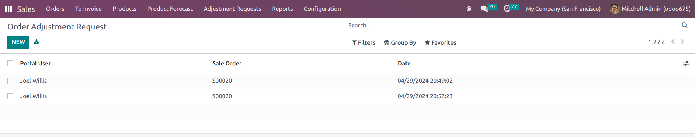

# About
This is a Vendor Self service portal module for Fatmug Designs. It allows a vendor to view and download a number or all upcoming product demand forcast for the next quater (3 months) in PDF and excel format from their dashboards and also submit an order adjustment request for existing sales order to the procurement team. The procurement team will receive an email each time a portal vendor user submits a sale order adjustment report.

# Module Dependency
For the module to be installed and function properly, the following dependency must exist already installed. Dependencies are configured in the manifest file [Manifest File](__manifest__.py)
- `Sales Module`.
- `Portal Module`.
- `Product Module`

# Third Party Plugins
Third party css and Javascript plugins were used for this project. This files are found in [CSS folder](static/src/css) and [Javascript Folder](static/src/css). The plugins includes:
- `alertify` which gives alert notification on the portal. Link to the plugin is found here: [Alertify Plugin](http://alertifyjs.com)
- `WaitMe` which shows a loader for certain events on portal. We used this instead of odoo's `web.framework`. Link to the plugin is found here: [WaitMe](https://github.com/vadimsva/waitMe)
- `Selectize` which allows vendor to quickly search for a sale order in select field during sale order adjustment request submission. Link to the plugin is found here: [Selectize](https://github.com/selectize)
- `colorlib-wizard-5 html step template` which allows for stepwise collection of data from vendor during sale order adjustment request. The plugin comes with Jquery steps plugin and other css plugin. Link to the plugin is found here: [Colorlib-wizard-5](https://colorlib.com/wp/template/colorlib-wizard-5/)

# Access Rights and Security rules
The portal user who is a vendor ordinarily do not have access to certain odoo models. For the module to function properly, read access was granted to the following models. This is implemented in [Access Rights](security/ir.model.access.csv)
- `vendor.adjustment.request`.
- `vendor.forecast`.
- `product.product`
- `product.template`
- `ir.actions.report`

# Javascript Codes
The build used more of javascript code as it's more of a front-end design. Changes were made in [main.js](static/src/js/main.js) file and [jquery.steps.js](static/src/js/jquery.steps.js) to make the front-end wizard steps and report generation flow as intended.

   # Wizard steps
   The code segment below helps the wizard step to flow as expected and collect all data in the last step

   ```
   	case "next":
            
            // modify the behaviour of wizard to ensure each field is filled
            if(state.currentIndex === 0){
                let order_id = wizard.find("#order_id")[0];
                let selected_order = order_id.options[order_id.selectedIndex].value;
                console.log(selected_order)
                if(selected_order == ''){
                    alertify.error("<small style='color:#fff;'>Order Number is Mandatory</small>");
                    return
                }

            }else if(state.currentIndex === 1){
                let adjustment_detail = wizard.find("#adjustment_detail")[0];
                let entered_adjustment_detail = $.trim(adjustment_detail.value);
                console.log(entered_adjustment_detail)
                if(entered_adjustment_detail == ''){
                    alertify.error("<small style='color:#fff;'>Adjustment Detail is Mandatory</small>");
                    return
                }
            }else if(state.currentIndex === 2){
                let comment = wizard.find("#comment")[0];
                let entered_comment = $.trim(comment.value);
                console.log(entered_comment)
                if(entered_comment == ''){
                    alertify.error("<small style='color:#fff;'>Please Provide Additional Comment</small>");
                    return
                }
            }

   ```
   For the last step, all input data is collected to the backend as follows:

   ```
           case "finish":

            finishStep(wizard, state);
            $('li').css('pointer-events', 'none')
            // submit form with ajax
            odoo.define('vendor_self_service_portal.main_js', function (require) {
              'use strict';
              var ajax = require("web.ajax");
              //var framework = require('web.framework');
              let order_id = wizard.find("#order_id")[0];
              let selected_order = order_id.options[order_id.selectedIndex].value;
              let adjustment_detail = wizard.find("#adjustment_detail")[0];
              let entered_adjustment_detail = $.trim(adjustment_detail.value);
              let comment = wizard.find("#comment")[0];
              let entered_comment = $.trim(comment.value);

              // start overlay
              //framework.blockUI();
              $("body").waitMe({effect : "ios", text : "Submitting, Please wait...", bg : "rgba(255,255,255,0.7)", color : "#000", maxSize : "", waitTime : -1, textPos : "vertical", fontSize : "20", source : "", onClose : function() {} });
              ajax.jsonRpc("/my/submit_order_adjustment", "call", {"order_id" : selected_order, "adjustment_detail":entered_adjustment_detail, "comment":entered_comment, }).then(function (data) {
              console.log(data)
              if(data.success == true){
                $("body").waitMe("hide")
                alertify.success("<small style='color:#fff;'>Request Submitted.</small>");
                setTimeout(function(){
                $("body").waitMe({effect : "ios", text : "Reloading, Please wait...", bg : "rgba(255,255,255,0.7)", color : "#000", maxSize : "", waitTime : -1, textPos : "vertical", fontSize : "20", source : "", onClose : function() {} });
              }, 1000)
                setTimeout(function(){
                location.reload()
                
              }, 4000)
              }else{
                $("body").waitMe("hide")
                alertify.error("<small style='color:#fff;'>Error Submitting Request.</small>");
                setTimeout(function(){
                $("body").waitMe({effect : "ios", text : "Reloading, Please wait...", bg : "rgba(255,255,255,0.7)", color : "#000", maxSize : "", waitTime : -1, textPos : "vertical", fontSize : "20", source : "", onClose : function() {} });
              }, 1000)                
                setTimeout(function(){
                location.reload()
                //framework.unblockUI();
              }, 3000)
              }
              

            });
          })

   ```
   The select box of the wizard in the first step was initialized to be searchable with the below code in [main.js](static/src/js/main.js):

   ```
   // make the sale order field searchable select
    $('#order_id').selectize({
        sortedField: 'text'
    })

   ```
   # Report Generation
   Checkboxes were added to the front-end in the template design [templates.xml](views/templates.xml) and behaviour was controlled in [main.js](static/src/js/main.js) to download reports as below:

   ```
   // hide and uncheck all checkboxes
	 $('#report_type_many').hide();
	 $('#check_forcast').prop('checked', false);
	 $('.check_forcast_all').prop('checked', false);
	 $('#excel_report_many').prop('checked', false);
	 $('#pdf_report_many').prop('checked', false);
	  var report_id = []
	  var report_type;
	 // select all forcast for download of report
	 $('#check_forcast').click(function() {
	    var inputs = document.querySelectorAll('.check_forcast_all');
	        
	   if(this.checked) {
	    for (var i = 0; i < inputs.length; i++) {
	      // console.log("Checkbox Value: "+ );
	      inputs[i].checked = true;
	      var intValue = parseInt(inputs[i].value)
	      var rindex = report_id.indexOf(intValue)
	      if(rindex > -1){
	        // do nothing
	      }else{
	        report_id.push(intValue)
	      }
	      
	    }
	    $('#o_report_portal_generate_mass').show()
	    $('#report_type_many').show()
	    console.log(report_id)
	   }
	   else{
	    for (var i = 0; i < inputs.length; i++) {
	      inputs[i].checked = false;
	      var intValue = parseInt(inputs[i].value)
	      var rindex = report_id.indexOf(intValue)
	      if(rindex > -1){
	        report_id.splice(rindex, 1)
	      }
	    }
	    $('#o_report_portal_generate_mass').hide()
	    $('#excel_report_many').prop('checked', false);
	    $('#pdf_report_many').prop('checked', false);
	    report_type = ''
	    $('#report_type_many').hide()
	    console.log(report_id)
	   }
	 });

	  $('.check_forcast_all').click(function() {

	    if(this.checked) {
	        $('#check_forcast').prop('checked', false);
	        $('#o_report_portal_generate_mass').show()
	        $('#report_type_many').show()
	        var rindex = report_id.indexOf(parseInt(this.value))
	        if(rindex > -1){
	        // do nothing
	        }else{
	            report_id.push(parseInt(this.value))    
	        }
	    }else{
	        $('#check_forcast').prop('checked', false);
	        var rindex = report_id.indexOf(parseInt(this.value))
	        if(rindex > -1){
	            report_id.splice(rindex, 1)
	        }else{
	            // do nothing   
	        }

	        var inputs = document.querySelectorAll('.check_forcast_all');
	        var is_checked = []
	        for (var i = 0; i < inputs.length; i++) {

	        // check if report ids array is empty
	        if(report_id.length == 0){
	            $('#check_forcast').prop('checked', false);
	            $('#o_report_portal_generate_mass').hide()
	            $('#excel_report_many').prop('checked', false);
	            $('#pdf_report_many').prop('checked', false);
	            $('#report_type_many').hide()
	        }
	    }
	    }
	        console.log(report_id)
	 })

	    $('#o_report_portal_generate_mass').click(function() {
	        console.log(report_type)
	        if(report_type == '' || report_type == undefined){

	            alertify.error("<small style='color:#fff;'>Select One Report type.</small>");
	            return
	        }
	        // sort array in ascending order
	        report_id.sort(function(a,b){ return a - b})

	        // start loader
	        $("body").waitMe({effect : "ios", text : "Generating Report, Please wait...", bg : "rgba(255,255,255,0.7)", color : "#000", maxSize : "", waitTime : -1, textPos : "vertical", fontSize : "20", source : "", onClose : function() {} });
	         if (report_type == 'excel_report_many'){
	         $.ajax({
	            type: 'POST',
	            url: '/my/product_forcast_report',
	            xhrFields:{responseType: 'arraybuffer'},
	            data: {"report_ids": JSON.stringify(report_id), "report_type": report_type},
	            success: function(response, status, xmlHeaderRequest) {
	                console.log(response)
	                $("body").waitMe("hide")
	                if(xmlHeaderRequest.getResponseHeader('Content-Type') == 'application/vnd.ms-excel'){
	                    var blob = new Blob([response], {type: xmlHeaderRequest.getResponseHeader('Content-Type')})
	                    var link = document.createElement('a')
	                    var url = window.URL || window.webkitURL
	                    link.href = url.createObjectURL(blob)
	                    random = Math.floor(Math.random() * 10000)
	                    link.download = 'Forcast_Report_'+random+'.xlsx'
	                    link.click()

	                }
	                
	            },
	            error: function(xhr, status, error) {
	                $("body").waitMe("hide")
	                alert("Error: " + error);
	            }
	        });

	 }else{
	        $.ajax({
	            type: 'POST',
	            url: '/my/product_forcast_report',
	            data: {"report_ids": JSON.stringify(report_id), "report_type": report_type},
	            success: function(response, status, xmlHeaderRequest) {
	                console.log(response)
	                $("body").waitMe("hide")
	                    window.open(response, '_blank')
	                
	            },
	            error: function(xhr, status, error) {
	                $("body").waitMe("hide")
	                alert("Error: " + error);
	            }
	        });
	 }

	 })

	  $('#excel_report_many').click(function() {
	    if ($('#excel_report_many').is(':checked')) {

	            report_type = 'excel_report_many'
	            $('#pdf_report_many').prop('checked', false);
	    }else{
	        report_type = ''
	        $('#pdf_report_many').prop('checked', false);
	    }

	 })

	  $('#pdf_report_many').click(function() {

	    if ($('#pdf_report_many').is(':checked')) {

	            report_type = 'pdf_report_many'
	            $('#excel_report_many').prop('checked', false);
	    }else{

	        report_type = ''
	        $('#excel_report_many').prop('checked', false);
	    }
	 })

   ```
# Installation of Module
Ensure that all dependency modules are available on your odoo system. Then clone this repository. Ensure that all files are in a folder named `vendor_self_service_portal`.
* Move the folder to odoo custom addons directory on server
* Restart the odoo service
* Login as admin with settings access rights and enable the debug mode from settings
* From apps menu, click on update module list
* Search for `vendor_self_service_portal`, then click on activate to install


# How to use
- Login as admin and add product forcast from the sales app menu `Product Forecast` .
- Login as a Vendor Portal user to see added menu for submission of sales order adjustment request and upcomng demand forcast .
- As A Vendor, click on `Order Adjustment` to submit an Order Adjustment or `Product Forcast` to see upcoming product demand forcast.
	# Order Adjustment
	- Select a sale order number and click on `Next` to progress the step wizard 
	- Enter Adjustment to order and click on `Next` to progress the wizard 
	- Enter an Addition comment to progress wizard to the last stage 
	- As a last step, click on submit request to send your request and procurement team members receive email to that effect.
	- Procurement Team members receive emails 
	- Procurement team member login to backend to see adjustment request in the `Adjustment Request` Menu from sales app, click on sale order to open form view to see details that needs to be adjusted and proceed to make the adjustment. 

	# Upcoming Product Demand Forcast
	- click on first checkbox to select all forcast displayed on page or click on any of the checkbox for any product, then select a format to download, then click on `Generate Report` button 
	- Generate Report button with report format appears 
	- PDF Report generated 
	- Excel Report Generated 

# Suggestion for Improvement
This design is solely based on the specification received. During the course of implementation, it was discovered that while the Excel report can be generated and downloaded easily, the PDF report generation approach especially when initiated from the front-end requires the report to be saved at first generation as an attachment as seen below in [models.py](models/models.py):

```
# server action function to download pdf report
def print_vendor_forcast_report(self, data=None):
    if data:
        data_bin = self.env['ir.actions.report']._render_qweb_pdf('vendor_self_service_portal.action_report_vendor_cert', res_ids=data)
        data_bin1 = base64.b64encode(data_bin[0])
        randnum = random.randint(1, 10000)
        attachment_id = self.env['ir.attachment'].sudo().create({'name': 'Forcast_Report_'+str(randnum)+'.pdf', 'type': 'binary', 'datas': data_bin1, 'store_fname': 'Forcast_Report_'+str(randnum)+'.pdf', 'public': True, 'mimetype': 'application/x-pdf'})
        download_url = '/web/content/' + str(attachment_id.id) + '?download=true'
        return download_url
    return self.env.ref('vendor_self_service_portal.action_report_vendor_cert').report_action(self, data=data)

``` 
This approach returns the url of the saved pdf file as an attachement in the `ir.attachment` model. This will increase database size in the long-run as more data is stored in this model which often is not reused or requested often. As an improvement, I suggest that a cron-job be designed to delete attachments with a prefix name of `Forcast_Report_` if creation date is more than 24 hours to clean up the redundant data.
